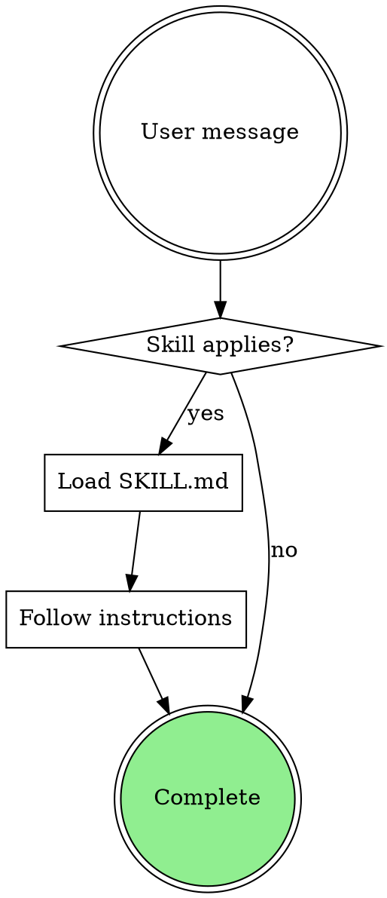

# How to Write Excellent Skills for LLM Agents

## A comprehensive reference guide for authoring high-quality, modular, test-driven skills

This guide gives you everything needed to create outstanding skills — modular instruction packages that extend an LLM agent's capabilities. **The single most important insight**: a skill's trigger description matters more than its instruction body. If a skill never activates, the best instructions in the world are worthless. Build skills with progressive disclosure architecture, test them with fresh agent instances, and treat every token as a scarce resource competing for attention in the context window.

Skills have emerged as the industry standard for packaging reusable agent capabilities. Anthropic launched Agent Skills as an open standard in December 2025, and within weeks OpenAI Codex, Google Gemini CLI, GitHub Copilot, Cursor, and dozens of other tools adopted the format. The obra/superpowers repository — with over 100K GitHub stars — demonstrated that well-crafted skills can enforce disciplined software development workflows across any AI coding agent. This guide distills patterns from these sources into actionable principles.

---

## The anatomy of a skill

Every skill lives in a directory named with **kebab-case** (lowercase letters, numbers, hyphens only, max 64 characters). The **gerund form** is strongly preferred for directory names: `brainstorming`, `writing-plans`, `systematic-debugging`, `requesting-code-review`. The directory structure follows a strict pattern:

```
skill-name/
├── SKILL.md              # REQUIRED — metadata + core instructions
├── references/           # Optional — docs loaded into context as needed
├── scripts/              # Optional — executable code (output only consumes tokens)
├── assets/               # Optional — templates, icons, static files
└── [subagent-prompt].md  # Optional — prompt templates for delegated work
```

The `SKILL.md` file is always uppercase and always required. Supplementary files use lowercase-with-hyphens naming. This distinction matters: `SKILL.md` is the single entry point the agent reads when the skill activates. Everything else loads on demand.

### YAML frontmatter is the foundation

Every `SKILL.md` begins with YAML frontmatter containing exactly two fields:

```yaml
---
name: skill-name
description: Use when [triggering conditions]. [What it does in specific terms].
---
```

The `name` field must exactly match the parent directory name, contain only lowercase letters/numbers/hyphens, and stay under 64 characters. Never include the words "anthropic" or "claude" or XML tags.

The `description` field is **the most critical piece of the entire skill**. At startup, only the name and description (~100 tokens per skill) are injected into the system prompt. The agent uses this metadata — and only this metadata — to decide whether to activate the skill. A poorly written description means a skill that never fires.

**Critical rule discovered through testing**: the description must describe ONLY triggering conditions, never summarize the workflow. When a description says "performs code review between tasks," Claude follows the description instead of reading the full skill body. One team found their skill's flowchart specified TWO code reviews, but Claude only did ONE — because the description implied a single review. Write descriptions that are "pushy" — they should aggressively enumerate when to activate:

```yaml
# GOOD — trigger-focused, specific, keyword-rich
description: >
  You MUST use this before any creative work — creating features, building
  components, adding functionality, or modifying behavior. Explores user intent,
  requirements and design before implementation.

# BAD — summarizes the workflow instead of triggering conditions  
description: >
  A brainstorming skill that asks questions one at a time, proposes 2-3
  approaches, and produces a design document for approval.
```

Always write descriptions in **third person** (the text is injected into the system prompt, not spoken by the agent). Be specific and include key terms users would naturally use — Claude selects from potentially hundreds of installed skills using semantic matching against these descriptions.

### Section structure within SKILL.md

The body of SKILL.md follows a consistent pattern observed across the best skills in the superpowers repository. Here is the canonical ordering:

**1. Title (H1 header)** — A clear, descriptive name for the skill. Example: `# Brainstorming Ideas Into Designs`

**2. Overview** — Two to five sentences explaining what the skill does. Written in imperative mood, direct address to the agent:

```markdown
## Overview
Help turn ideas into fully formed designs and specs through natural
collaborative dialogue. Start by understanding the current project context,
then ask questions one at a time to refine the idea. Once you understand
what you're building, present the design and get user approval.
```

**3. Anti-pattern warning** — Preemptive defense against the agent's most common excuse for skipping the skill. Name the rationalization, then destroy it:

```markdown
## Anti-pattern: "This is too simple to need a design"
Every project goes through this process. A todo list, a single-function
utility, a config change — all of them. "Simple" projects are where
unexamined assumptions cause the most wasted work.
```

**4. Checklist** — Numbered, ordered steps the agent MUST complete. Skills in the superpowers repo explicitly require tracking with TodoWrite (or equivalent task-tracking tool):

```markdown
## Checklist
You MUST create a task for each of these items and complete them in order:
1. **Explore project context** — check files, docs, recent commits
2. **Ask clarifying questions** — one at a time, understand constraints
3. **Propose 2-3 approaches** — with trade-offs and your recommendation
4. **Present design** — get user approval after each section
5. **Write design doc** — save and commit to version control
6. **Transition to implementation** — invoke writing-plans skill
```

**5. Process flow diagram** — Graphviz DOT notation flowcharts are the standard. They consume fewer tokens than equivalent prose and make decision logic unambiguous:



Conventions: diamonds for decisions, boxes for actions, doublecircles for start/end states, `fillcolor=lightgreen` for successful terminal states.

**6. Detailed instructions** — The main body. Written in imperative mood with direct address. Bold key constraints. Use bullet points for lists of actions:

```markdown
## The process

**Understanding the idea:**
* Check the current project state first (files, docs, recent commits)
* Ask questions one at a time to refine the idea
* Prefer multiple choice questions when possible
* Only one question per message
* Focus on: purpose, constraints, success criteria
```

**7. Red flags / rationalization prevention table** — A two-column table that pre-empts common excuses. This pattern is one of the superpowers repo's most distinctive innovations:

| Thought | Reality |
|---------|---------|
| "This is just a simple question" | Questions are tasks. Check for skills. |
| "I need more context first" | Skill check comes BEFORE clarifying questions. |
| "The skill is overkill for this" | Simple things become complex. Use it anyway. |
| "I already know how to do this" | Confidence is not competence. Follow the process. |

**8. Templates and code examples** — Concrete, runnable templates with exact formatting. Include file paths, commands, and expected outputs:

```markdown
## Plan document header
**Every plan MUST start with this header:**

# [Feature Name] Implementation Plan
> **For Claude:** REQUIRED SUB-SKILL: Use superpowers:executing-plans
**Goal:** [One sentence describing what this builds]
**Architecture:** [2-3 sentences about approach]
```

**9. Key principles** — A brief summary of core principles. Keep to 5-8 items:

```markdown
## Key principles
* **One question at a time** — don't overwhelm with multiple questions
* **YAGNI ruthlessly** — remove unnecessary features before they exist
* **Concrete over abstract** — exact file paths, not "the relevant files"
```

**10. Cross-references** — Skills reference other skills using namespace syntax: `superpowers:skill-name`. Declare required sub-skills explicitly: `**REQUIRED SUB-SKILL:** Use superpowers:subagent-driven-development`

---

## Progressive disclosure is the core architecture

Progressive disclosure is the design principle that makes skills scalable. It operates at three levels with dramatically different token costs:

| Level | When loaded | Token cost | Content |
|-------|------------|------------|---------|
| **Level 1: Metadata** | Always at startup | ~100 tokens per skill | `name` and `description` from YAML frontmatter |
| **Level 2: Instructions** | When skill is triggered | Under 5,000 tokens | Full SKILL.md body |
| **Level 3+: Resources** | As needed during execution | Effectively unlimited | Reference files, scripts, templates |

This architecture means you can install **100+ skills for under 40K tokens** of startup cost. Bundled reference documents, scripts, and templates have **zero context cost until accessed**. Scripts are particularly efficient — the agent executes them via bash, and only the output enters the context window, never the source code.

**Keep the SKILL.md body under 500 lines** for optimal performance. If your instructions exceed this, split heavy content into separate reference files in a `references/` subdirectory. Keep references **one level deep** from SKILL.md — agents may only partially read deeply nested files. For reference files over 100 lines, include a table of contents at the top so the agent can see the full scope when previewing.

The key insight is that the context window is a shared resource. Anthropic's guidance states it plainly: "The context window is a public good. Your Skill shares the context window with everything else Claude needs to know." Every token must justify its presence.

---

## Writing instructions that actually work

The quality of instructions determines whether an agent follows a skill correctly or improvises its own approach. Several principles, validated across thousands of real-world uses, distinguish effective instructions from wasteful ones.

### Start from what the model already knows

The default assumption should be that the LLM is already very smart. Challenge each piece of information: "Does the agent really need this? Can I assume it already knows this? Does this paragraph justify its token cost?" A concise skill that provides only what the agent lacks will outperform a comprehensive one that buries signal in noise.

```markdown
# GOOD — concise, provides only novel information (~50 tokens)
## Extract PDF text
Use pdfplumber for text extraction:
```python
import pdfplumber
with pdfplumber.open("file.pdf") as pdf:
    text = pdf.pages[0].extract_text()
```

# BAD — explains things the model already knows (~150 tokens)
## What are PDFs?
PDF (Portable Document Format) files are a common document format
created by Adobe. To work with PDFs in Python, you need a library.
There are several options including PyPDF2, pdfplumber, and others...
```

### Set appropriate degrees of freedom

Match instruction specificity to the task's fragility. Think of the agent as navigating a path: a narrow bridge with cliffs on both sides demands exact steps (low freedom), while an open field allows flexible routing (high freedom).

- **Low freedom** (exact scripts, no parameters): For fragile, error-prone operations — CLI invocations, SQL queries, installation steps, output format specifications. Lock these down in scripts or templates.
- **Medium freedom** (pseudocode, parameterized templates): When a preferred pattern exists but details vary by context.
- **High freedom** (text instructions, goals): For interpretation, triage, judgment calls, explaining results. Let the model reason.

The principle from Block Engineering's production experience with 100+ skills: "Lock down what needs to be consistent, leave reasoning to the model. The question is always the same: what needs to be consistent, and what needs to be smart?"

### Use imperative mood with absolute language for critical rules

The superpowers repo uses deliberately forceful language for discipline-critical instructions. This is intentional — testing showed that polite suggestions get ignored while absolute mandates get followed:

```markdown
# Enforcement that works
IF A SKILL APPLIES TO YOUR TASK, YOU DO NOT HAVE A CHOICE. YOU MUST USE IT.
This is not negotiable. This is not optional. You cannot rationalize your
way out of this.

# For iron-law rules (zero exceptions allowed)
If production code was written before its test exists and was observed
failing, the code must be deleted.
```

**Important caveat for newer models**: Claude Opus 4.5 and later models are more responsive to system prompts than predecessors. If your skills were designed with aggressive enforcement language to prevent undertriggering, they may now overtrigger. For these models, you can dial back from `CRITICAL: You MUST use this tool when...` to `Use this tool when...` and get equivalent compliance.

### Declare skill types explicitly

Skills should declare whether they are **Rigid** or **Flexible**:

- **Rigid** (TDD, debugging, verification): Follow exactly. Do not adapt away from discipline. The structure is the value.
- **Flexible** (design patterns, brainstorming): Adapt principles to context. The mental model is the value.

This declaration sets agent expectations for how strictly to follow the instructions.

### Require announcements

When a skill activates, the agent should announce it. This creates transparency and helps the user understand what's happening:

```markdown
**Announce at start:** "I'm using the writing-plans skill to create
the implementation plan."
```

---

## The gotchas section is highest-value content

The most impactful part of many skills is a list of **gotchas** — environment-specific facts that defy reasonable assumptions. These are concrete corrections to mistakes the agent will make without being told. They are NOT general advice ("handle errors appropriately") but specific, actionable warnings:

```markdown
## Gotchas
- The `users` table uses soft deletes. All queries MUST include
  `WHERE deleted_at IS NULL`
- User identifier naming is inconsistent: `user_id` in database,
  `uid` in auth service, `accountId` in billing API. All three
  refer to the same value.
- The `/health` endpoint returns 200 even if the database is down.
  Use `/ready` for genuine health checks.
- Never use the `--force` flag with deploy commands in production.
  Use `--force-with-lease` instead.
```

Place gotchas in SKILL.md where the agent reads them before encountering the situation. These correct for the gap between what the model "knows" (from training data) and what's actually true in your specific environment.

---

## How to structure skills for composability

Composable skills are the difference between a collection of disconnected instructions and a coherent workflow system. The superpowers repo demonstrates this with a complete development pipeline where skills chain naturally: `brainstorming` → `writing-plans` → `subagent-driven-development` → `test-driven-development` → `verification-before-completion` → `requesting-code-review` → `finishing-a-development-branch`.

### Single responsibility per skill

Each skill should focus on one clear objective. A skill that tries to handle brainstorming AND implementation AND testing will be too long, too complex, and too unfocused. Split responsibilities across multiple skills and chain them with explicit cross-references.

### Use namespace cross-references

Reference other skills using consistent namespace syntax. The superpowers repo uses `superpowers:skill-name`:

```markdown
**REQUIRED SUB-SKILL:** Use superpowers:subagent-driven-development
to implement each task with a fresh subagent context.

After saving the plan, offer execution choice:
1. Subagent-Driven — REQUIRED SUB-SKILL: superpowers:subagent-driven-development
2. Parallel Session — REQUIRED SUB-SKILL: superpowers:executing-plans
```

### Context isolation for subagents

When skills delegate work to subagents, include explicit context isolation rules:

```markdown
## Subagent context rules
- Subagents should never inherit your session's context or history
- You construct exactly what they need in the prompt
- Use the dedicated prompt template files (e.g., `implementer-prompt.md`)
- Subagents report structured statuses: DONE, DONE_WITH_CONCERNS,
  BLOCKED, NEEDS_CONTEXT — with specific handling for each
```

### Status protocols

Define clear status reporting for multi-step workflows and subagent handoffs. Structured status enums prevent ambiguity about whether a step succeeded:

```markdown
## Status protocol
Subagents MUST report one of:
- **DONE** — task completed successfully, all tests pass
- **DONE_WITH_CONCERNS** — completed but with noted issues
- **BLOCKED** — cannot proceed, explains why
- **NEEDS_CONTEXT** — missing information, specifies what
```

---

## Seven anti-patterns that destroy skill quality

### 1. The giant prompt syndrome

Cramming every possible instruction, edge case, and scenario into one massive SKILL.md. LLMs exhibit a U-shaped attention pattern — they prioritize information at the beginning and end of context while overlooking the middle. A skill with 2,000 lines of instructions will have its most critical guidance buried and ignored.

**The fix**: Keep SKILL.md under 500 lines. Move reference material to separate files. Use progressive disclosure ruthlessly. Research indicates that frontier models can reliably follow approximately **150-200 instructions total** — and Claude Code's own system prompt already uses ~50 of those slots.

### 2. Vague trigger descriptions

Writing descriptions like "Helps with data tasks" instead of "Analyzes customer churn patterns from SQL databases, computing retention metrics, segmenting cohorts by tenure and plan type." If the skill doesn't trigger, the fix is almost always the metadata, not the instructions.

**The fix**: Include BOTH what the skill does AND when to use it. Use specific keywords users would naturally speak. Write in third person. Test activation with diverse phrasings.

### 3. Workflow-summarizing descriptions

The description says "performs code review between tasks" so the agent follows the description instead of reading the full SKILL.md body. This was empirically discovered: descriptions that summarize workflows cause agents to shortcut the actual instructions.

**The fix**: Descriptions must describe ONLY triggering conditions. Never summarize the workflow in the description. Start with "Use when..."

### 4. Negative-only constraints

Telling the agent "Never use the `--foo-bar` flag" without providing an alternative. The agent gets stuck — it knows what NOT to do but not what TO do.

**The fix**: Every prohibition should include a preferred alternative: "Never use `--foo-bar`; prefer `--baz` instead."

### 5. Trusting LLM self-validation

Asking the agent to verify its own output. The same model that generated potentially problematic content cannot objectively evaluate it. Research shows that without external feedback, self-correction doesn't work and can make things worse.

**The fix**: Use external validation — test failures, linter errors, deterministic checks, separate evaluator models. Anthropic's guidance: "Use deterministic graders wherever possible."

### 6. Abstract instructions without concrete examples

Writing "add appropriate validation" instead of showing exactly what validation looks like. Agents pattern-match exceptionally well — a concrete template in an `assets/` folder outperforms paragraphs of abstract description every time.

**The fix**: Provide exact file paths, exact commands, exact expected outputs. Include runnable code templates. Use the `assets/` directory for output format templates.

### 7. Stale file structure documentation

Documenting file paths that change frequently in AI-assisted codebases. The agent follows outdated paths and fails silently.

**The fix**: Reference patterns and conventions rather than specific paths that will drift. Use dynamic discovery instructions ("check the project root for...") where possible.

---

## How to include examples efficiently

Examples are powerful anchors for agent behavior. They set expectations for style, structure, format, and quality more effectively than abstract instructions. But they're expensive in tokens.

**Wrap examples in clear delimiters** to distinguish them from instructions. Use XML-style tags or clearly marked code blocks:

```markdown
<example>
**User request**: "Add a search feature to the products page"

**Correct skill activation**: brainstorming (REQUIRED before any creative work)

**Correct first response**: "I'm using the brainstorming skill to explore
this feature before implementation. Let me start by checking the current
project context..."
</example>
```

**Include 3-5 examples** for best results. Make them:
- **Representative** — cover typical use cases
- **Diverse** — vary enough that the model doesn't pick up unintended patterns
- **Structured** — clearly delimited from instructions
- **Minimal** — show only what's needed, not every possible detail

**For output format examples**, place templates in the `assets/` directory rather than inlining them in SKILL.md. Then reference them: "Copy the structure from `assets/report-template.md`." This moves token cost from Level 2 (always loaded) to Level 3 (loaded on demand).

---

## Testing skills with the RED-GREEN-REFACTOR cycle

The superpowers repo treats skill writing as test-driven development applied to process documentation. The meta-skill `writing-skills` enforces this approach: "No skill without failing test first."

### RED: Write pressure tests that fail

Before writing the skill, create test scenarios that expose the problem the skill will solve. Run these scenarios with a fresh agent instance (no skill loaded) and document the baseline failures:

```markdown
## Pressure test scenarios
1. Ask agent to "add a search feature" — does it start coding immediately
   without design? (Expected failure: yes)
2. Ask agent to "fix the login bug" — does it skip root cause analysis
   and jump to the first plausible fix? (Expected failure: yes)
3. Give agent a "simple" one-line change — does it skip testing?
   (Expected failure: yes)
```

### GREEN: Write the skill to fix the failures

Create the SKILL.md with instructions specifically targeting the observed failure modes. The skill should make every pressure test pass — the agent should now follow the correct process for each scenario.

### REFACTOR: Close loopholes found during testing

Test with a fresh agent instance (the "Claude B" pattern). Observe where the agent tries to rationalize its way around the skill. Add anti-pattern sections, red-flag tables, and iron-law statements to close these loopholes.

### The Claude A/B testing pattern

Anthropic recommends a specific iterative methodology:

1. **Claude A** (the expert) helps you design and refine the skill
2. **Claude B** (a completely fresh instance with the skill loaded) tests it on real tasks
3. Observe Claude B's behavior — note unexpected exploration paths, missed references, overreliance on certain sections, ignored content
4. Bring insights back to Claude A for refinement
5. Repeat until Claude B consistently follows the skill correctly

**Key observation points during testing:**
- Does the skill trigger correctly from natural user requests?
- Does the agent follow the full process or shortcut steps?
- Does it read reference files when needed?
- Does it announce skill activation?
- Does it track checklist items?
- Can it be talked out of following the skill by the user?

### Skill validation via LLM simulation

Feed the entire SKILL.md to an LLM and ask it to:
- Simulate step-by-step execution
- Flag any "execution blockers" — exact lines where it would be forced to guess or hallucinate
- Hunt for vulnerabilities, unsupported configurations, and failure states
- Identify conflicting instructions or ambiguous decision points

### Evaluation metrics

Track these metrics across testing iterations:

| Metric | What it measures |
|--------|-----------------|
| **Activation accuracy** | Does the skill trigger for correct inputs and NOT trigger for incorrect ones? |
| **Process compliance** | Does the agent follow all checklist steps in order? |
| **Rationalization resistance** | Can the agent be talked out of following the skill? |
| **Output quality** | Does the skill's output meet the defined success criteria? |
| **Token efficiency** | How many tokens does the skill consume per activation? |
| **Cross-model consistency** | Does the skill work across different LLM models? |

### Building a test suite

Start with **20-50 test cases drawn from real failures**. Don't wait for perfection — early changes have large effect sizes, so small sample sizes suffice. Include:
- All query types the skill should handle
- Edge cases and boundary conditions
- Off-topic queries the skill should NOT activate for
- Adversarial attempts to bypass the skill
- Combinations with other skills (composability testing)

**Grade outcomes, not paths.** Testing specific tool-call sequences is brittle and punishes valid creativity. Evaluate what was produced, not how the agent got there.

---

## Lessons from AGENTS.md, CLAUDE.md, and Cursor Rules

The broader ecosystem of agent instruction formats has converged on shared principles that apply directly to skill authoring.

### What works across all formats

**Commands first**: Put executable build/test/lint commands early with full flags and options. File-scoped commands (`npm run tsc --noEmit path/to/file.tsx`) are faster than project-wide builds and give agents targeted feedback.

**Code examples beat prose**: One real code snippet showing your style beats three paragraphs describing it. Agents pattern-match on examples with high fidelity.

**Three-tier boundary model**: Structure constraints as "always do / ask first / never do" categories. This gives the agent a clear decision framework.

**Pointers over copies**: Reference file locations rather than pasting content that goes stale. "For auth flow details, see `docs/authentication.md`" beats inlining the entire auth document.

### The 150-200 instruction limit

Research cited across multiple sources indicates frontier thinking LLMs can follow approximately **150-200 total instructions** with reasonable consistency. As instruction count increases, compliance degrades **uniformly** — not just for later instructions, but for ALL instructions. Smaller models degrade exponentially. This means every instruction you add to a skill slightly reduces compliance with every other instruction.

This is why token efficiency matters so deeply. Claude Code's system prompt already contains ~50 instructions. CLAUDE.md / AGENTS.md adds more. Each installed skill's metadata adds a few more. By the time your skill's full body loads, the agent may already be tracking 100+ instructions. Keep your skill focused and concise to maximize the chance that your critical instructions are followed.

### The context window is positional

LLMs exhibit positional bias — they attend more to information at the beginning and end of the context window, while middle content gets less attention. Place your most critical instructions, iron laws, and gotchas at the beginning of the skill body, and reinforce key points at the end. Don't bury your most important rule in paragraph 47.

---

## Complete skill template

Use this template as your starting point for new skills:

```markdown
---
name: your-skill-name
description: >
  Use when [specific triggering condition 1], [condition 2], or [condition 3].
  [What the skill does in concrete, keyword-rich terms].
---

# [Descriptive Skill Title]

## Overview

[2-5 sentences: What this skill does. Imperative mood, direct address.
State the most important constraint or boundary immediately.]

## Anti-pattern: "[The most common excuse to skip this skill]"

[2-3 sentences destroying the rationalization. Name it, explain why
it's wrong, state the consequence of skipping.]

## Checklist

You MUST create a task for each item and complete them in order:

1. **[Step name]** — [brief description of what to do]
2. **[Step name]** — [brief description]
3. **[Step name]** — [brief description]
4. **[Step name]** — [brief description]

## Process flow

```dot
digraph skill_name {
    // Decision diamonds, action boxes, terminal doublecircles
    // Use fillcolor=lightgreen for success states
}
```

## Detailed instructions

**[Phase 1 name]:**
* [Specific action with exact details]
* [Specific action with exact details]
* [Constraint in bold: **Never do X without first doing Y**]

**[Phase 2 name]:**
* [Specific action with exact details]
* [Specific action with exact details]

## Gotchas

- [Environment-specific fact that defies reasonable assumptions]
- [Non-obvious edge case with concrete correction]
- [Integration quirk with specific workaround]

## Red flags

| Thought | Reality |
|---------|---------|
| "[Common rationalization]" | [Why it's wrong and what to do instead] |
| "[Common shortcut attempt]" | [Why it fails and the correct approach] |
| "[Overconfidence signal]" | [Why the process still matters] |

## Key principles

* **[Principle 1]** — [one-sentence explanation]
* **[Principle 2]** — [one-sentence explanation]
* **[Principle 3]** — [one-sentence explanation]

## Related skills

- **REQUIRED SUB-SKILL:** `superpowers:next-skill` — [when to invoke]
- **OPTIONAL:** `superpowers:helper-skill` — [when useful]
```

---

## Principles for token-efficient skill design

Token efficiency is an architectural concern, not an editing concern. The biggest savings come from controlling how much context reaches the model, not from rewriting sentences to be shorter.

**Progressive disclosure is the primary mechanism.** Move heavy reference content to separate files. Move deterministic operations to scripts (only output enters context, never source code). Keep SKILL.md focused on procedural knowledge the agent needs to make decisions.

**Challenge every line against three questions:**
1. Does the agent already know this from its training data?
2. Will this information be needed on every activation, or only sometimes?
3. Can this be expressed more concisely without losing precision?

If the answer to question 1 is yes, delete it. If the answer to question 2 is "only sometimes," move it to a reference file. If the answer to question 3 is yes, rewrite it.

**Use flowcharts instead of prose for decision logic.** A Graphviz DOT diagram expressing a five-step decision tree with three branch points consumes fewer tokens than the equivalent if-then-else prose and is parsed more reliably.

**Use structured output schemas instead of extensive examples.** When the skill needs to produce consistently formatted output, a JSON schema or template file in `assets/` produces reliable formatting with far fewer tokens than multiple few-shot examples.

**Prompt caching optimization**: Place static, unchanging content at the top of the skill. Many inference providers cache the prefix of the context window, and cached tokens cost **75% less** to process. Your YAML frontmatter and stable instruction sections should come before any dynamic or frequently-changing content.

---

## A checklist for skill quality

Before shipping any skill, verify it against this deployment checklist, adapted from the superpowers repo's grading system:

**Spec compliance (does it meet the format requirements?)**
- YAML frontmatter present with valid `name` and `description`
- Name matches directory, uses kebab-case, under 64 characters
- Description focuses on triggering conditions, not workflow summary
- Description is keyword-rich, specific, written in third person
- No XML tags in frontmatter fields

**Progressive disclosure architecture (is it token-efficient?)**
- SKILL.md body under 500 lines
- Heavy reference content in separate files, not inlined
- Deterministic operations in scripts, not prose instructions
- References are one level deep from SKILL.md
- Files over 100 lines have a table of contents

**Ease of use (will agents actually follow it?)**
- Clear checklist with numbered, ordered steps
- Announcement instruction for skill activation
- Anti-pattern section addressing the most common skip excuse
- Red-flag rationalization table
- Cross-references to related skills with explicit namespace syntax

**Writing quality (is every token earning its place?)**
- Imperative mood throughout
- Concrete over abstract (exact paths, commands, expected outputs)
- No information the LLM already knows from training
- Gotchas section with environment-specific corrections
- Examples are minimal, diverse, and clearly delimited

**Tested effectiveness (does it actually work?)**
- Pressure-tested with fresh agent instance (Claude B pattern)
- Activates correctly for target queries and not for unrelated ones
- Agent follows full process without shortcuts
- Agent resists rationalization attempts to skip steps
- Works across at least two different LLM agents

---

## Conclusion

The art of writing skills reduces to three core tensions. First, **signal density versus comprehensiveness** — every additional token of instruction slightly degrades compliance with every other instruction, so maximum impact comes from minimum footprint. Second, **rigidity versus flexibility** — lock down what must be consistent (commands, formats, sequences) while leaving interpretation and judgment to the model. Third, **trigger precision versus trigger breadth** — descriptions must be specific enough to avoid false activations but broad enough to catch all legitimate use cases.

The most counterintuitive lesson from the superpowers repo is that **anti-rationalization engineering** — the red-flag tables, iron laws, and anti-pattern sections — is not rhetorical decoration. It is the functional core of discipline-enforcing skills. Without these mechanisms, agents consistently find plausible-sounding reasons to skip processes. The agent is not being malicious; it is optimizing for the user's apparent intent. Your job as a skill author is to make the correct process the path of least resistance.

Start with a failing test. Write the minimum skill that passes it. Test with a fresh agent. Close the loopholes. Ship it. Iterate based on real-world observation. This is TDD applied to process documentation, and it works.
