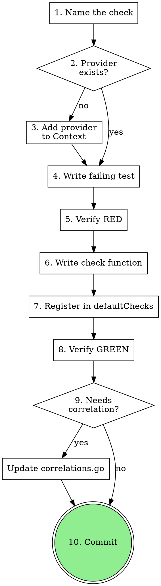

# Adding Symptom Checks to node_doctor

Add a new automated health check to the doctor package. Each check is born from a real investigation with real test data. Follow TDD: test first, then implement.

**Announce at start:** "Adding a new symptom check to node_doctor."

## Anti-pattern: "I'll just write the check function"

Skipping the checklist leads to unregistered checks, missing tests, or checks that depend on providers that don't exist. The checklist is 10 steps because each step has been a failure point. Follow all of them.

## Checklist

Complete these in order:

1. **Name the check** — pick a snake_case ID
2. **Identify provider** — which Context provider does it need? Does it exist?
3. **Add provider if needed** — field on Context, fetch function, test helper
4. **Write failing test** — minimum: one triggering case, one healthy case
5. **Run test, verify RED**
6. **Write check function** — standard signature, return `[]Finding` or nil
7. **Register check** — add to `defaultChecks` in `doctor.go`
8. **Run tests, verify GREEN**
9. **Update correlation** — if the new check participates in a correlation pattern, update `correlations.go`
10. **Commit**

## Process Flow



## Where Things Go

| What | File |
|------|------|
| Check needing RPC data | `internal/doctor/checks_rpc.go` |
| Check needing data dir | `internal/doctor/checks_data.go` |
| Check needing logs | `internal/doctor/checks_logs.go` |
| Correlation | `internal/doctor/correlations.go` |
| New provider | `internal/doctor/context.go` (field + test helper) |
| Check registration | `internal/doctor/doctor.go` (`defaultChecks` slice) |
| Correlation registration | `internal/doctor/doctor.go` (`defaultCorrelations` slice) |

## Check Function Pattern

Every check has this signature:

```go
func checkXxx(ctx *Context) ([]Finding, error) {
    data, err := ctx.someProvider.Get()
    if err != nil {
        return nil, err // provider unavailable → orchestrator handles it
    }
    // ... detection logic ...
    if healthy {
        return nil, nil // no findings = healthy
    }
    return []Finding{{
        ID:       "check_id",
        Severity: Warning, // Info, Warning, or Critical
        Detail:   fmt.Sprintf("human-readable description with %s", data),
        Source:   "rpc", // or "data_dir", "logs"
    }}, nil
}
```

**Error handling rules:**
- Provider error → return it (don't swallow)
- Parse error on data → return `fmt.Errorf(...)` (don't return nil, nil)
- Data missing/empty → return nil, nil (graceful skip)
- Threshold constants → named constants, not magic numbers

## Test Pattern

```go
func TestCheckXxx_Triggers(t *testing.T) {
    ctx := newTestContext(withSomeProvider(badData))
    findings, err := checkXxx(ctx)
    require.NoError(t, err)
    require.Len(t, findings, 1)
    assert.Equal(t, "check_id", findings[0].ID)
    assert.Equal(t, Warning, findings[0].Severity)
}

func TestCheckXxx_Healthy(t *testing.T) {
    ctx := newTestContext(withSomeProvider(goodData))
    findings, err := checkXxx(ctx)
    require.NoError(t, err)
    assert.Empty(t, findings)
}
```

## Adding a Provider (if needed)

```
context.go:  add field to Context struct
context.go:  add withXxx test helper
doctor.go:   wire fetch in RunDoctor (inside the if rpcClient/dataDir block)
```

Provider fetch functions can depend on other providers — lazy eval handles ordering:
```go
ctx.newThing = newProvider(func() (*Thing, error) {
    dep, err := ctx.existingProvider.Get()  // fetched lazily
    if err != nil { return nil, err }
    return computeNewThing(dep), nil
})
```

## Red Flags

| Thought | Reality |
|---------|---------|
| "The check is simple, I don't need tests" | Every check gets at least 2 tests. No exceptions. |
| "I'll register it later" | Unregistered checks don't run. Register immediately after writing. |
| "This error can't happen" | Return the error. The orchestrator handles it. Don't swallow. |
| "I'll add the correlation in a separate PR" | If the check participates in a correlation, update it now. |
