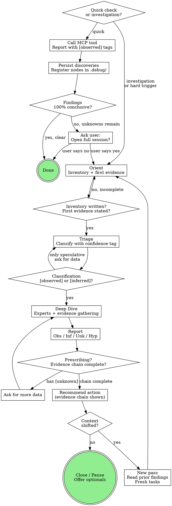

# Chain Investigation

Guide operators through interactive gno.land chain debugging. Ask what evidence is available, adapt to what the user provides, dispatch expert agents for domain reasoning, and consolidate findings into a structured session.

**Skill type: Rigid.** Follow the phase gates, confidence tags, and prescription checks exactly. The structure IS the value — do not adapt away from it.

**Announce at start:** "Starting a chain investigation. Let me gather context."

## Anti-Pattern: "I Already Understand This Chain"

The most dangerous failure mode is carrying confidence from one investigation phase into the next. Understanding the initial divergence does NOT mean you understand why recovery failed. Each context shift demands fresh evidence gathering with reset certainty. Earned confidence is phase-scoped — it does not transfer.

## MCP First — Non-Negotiable

**Use gnodig MCP tools for all node data inspection.** Never use raw RPC calls, scripts, or `go run` one-offs when an MCP tool exists.

- MCP not connected? **STOP.** Ask user to reconnect (`/mcp`).
- MCP tools don't expose the data you need? Flag it as a gnodig gap.

## Quick Check vs Full Investigation

Simple questions ("is this node healthy?", "what happened at height X?") skip full ceremony but still leave traces.

**Always start by reading `.debug/`** — even for quick checks. Check `.debug/nodes/<chain>/` for registered nodes (known endpoints, monikers, roles) and `.debug/sessions/` for previous investigations on this chain. Use what's there; don't rediscover what's already known.

**Quick check flow:**
1. Read `.debug/` for prior context on this chain
2. **Start with `node_doctor`** — one call gives chain health + context before addressing the user's specific question. If no RPC endpoint is available (not in `.debug/`, not provided by user), answer what you can and ask for an endpoint to run doctor.
3. Report with `[observed]` tags
4. **Persist discoveries** — register any new nodes/endpoints via `.debug/nodes/<chain>/<moniker>.yaml` (see existing files for format). Update existing entries if info changed.
5. **Escalation gate:** If findings are 100% conclusive → done. If not (unknowns remain, multiple components involved, root cause unclear) → ask the user: *"This looks like it needs deeper investigation. Want me to open a full session?"* Do NOT continue in quick-check mode with unanswered questions.

**Hard triggers for escalation** (don't ask, just transition):
- User asks to download data, logs, or artifacts
- User asks to SSH into a server
- A second person gets involved (colleague's question, coordination)
- Problem spans multiple nodes or multiple heights

## Checklist

For full investigations only. You MUST use TaskCreate to create a task for each of these items and complete them in order. Mark each as `in_progress` when starting, `completed` when done. Do NOT skip ahead — complete the current task before starting the next.

1. **Explore context** — check for previous sessions and registered nodes on this chain
2. **Orient** — ask what evidence exists, make first MCP calls, write inventory + first evidence
3. **Offer optionals** — session file? node registration? artifact storage?
4. **Triage** — classify the incident with confidence tag and cited evidence
5. **Deep Dive** — dispatch experts, tag every finding, update gaps after every tool call
6. **Report** — present Observations / Inferences / Unknowns / Hypotheses to user
7. **Prescription gate** — if recommending actions: evidence chain with no `[unknown]` steps
8. **Close or Pause** — offer optionals (report, summary, playbook, doctor, cleanup)
9. **Context shift** — if situation changes: new pass, read prior findings, fresh tasks

## Confidence Tags

Every finding must be tagged. No exceptions.

| Tag | Meaning |
|-----|---------|
| `[observed]` | Directly from MCP output, logs, or user. Cite source. |
| `[inferred]` | Deduction from multiple observations. Cite which. |
| `[speculative]` | Hypothesis. State what would confirm AND reject. |

<HARD-GATE>
Never prescribe chain-affecting actions (gnobr, restart, state patches) based on [speculative] findings. If the evidence chain contains [unknown] or [speculative] steps, the recommendation is BLOCKED. Ask for data instead.
</HARD-GATE>

## Process Flow

## Phase Summaries

For detailed instructions, see `references/phase-gates.md`.

### Orient

**Answers:** "What do I have and what's the big picture?"
- Ask what evidence exists (RPC, data dir, logs, multiple nodes, chain, height)
- Check for previous sessions on this chain
- Make first MCP calls (`node_doctor` recommended)
- Write inventory: Available + Missing
- State first evidence — facts only, `[observed]`, no interpretation
- **Gate:** Inventory + first evidence written. User confirmed.
- **NOT Orient:** "Node was gnobr'd to the wrong height" — that's diagnosis

### Triage

**Answers:** "What kind of problem is this?"
- If data supports classification: tag `[observed]` or `[inferred]`, cite evidence
- If ambiguous: dispatch `gno-investigator` agent
- List hypotheses as `[speculative]` with confirm/reject criteria
- **Gate:** Classification tagged with cited evidence
- **NOT Triage:** skipping to "here's what's wrong and how to fix it"

### Deep Dive

**Answers:** "What specifically happened and why?"
- Dispatch domain experts (tm2-expert, gnovm-expert, gnoland-expert, logs-analyst)
- Tag every finding. Update gaps after every tool call.
- Track hypotheses: `[speculative → inferred → confirmed]`
- No fixed end — loops until root cause or wall
- **NOT Deep Dive:** forming hypotheses without stating what would reject them

### Report

**Answers:** "Here's what I know, don't know, and think."
- Structure: Observations / Inferences / Unknowns / Hypotheses
- Prescription gate: evidence chain required, blocked if `[unknown]` steps
- User can override ("do it anyway") — document the override
- **NOT Report:** "The picture is clear" with `[speculative]` findings

### Close

**Triggers:** Root cause resolved, user pauses, no more data.
- Offer optionals in one message (report, summary, playbook, doctor, cleanup)
- Pause: write resumption context, keep artifacts
- Close: full sequence, finalize session

## Investigation Passes

Context shift = new pass, not new investigation. Previous findings carry forward.

1. Announce: "Situation changed. Starting a new pass."
2. Create new phase tasks
3. Orient reads previous pass findings
4. Gap list carries forward
5. Confidence levels reset — earned confidence does not transfer

See `references/phase-gates.md` for pass structure and session.md format.

## Artifacts

Raw data (DBs, logs, WAL) under `.debug/sessions/<slug>/artifacts/<moniker>/`. Ask before downloading, ask before cleaning up. See `references/artifacts.md`.

## Red Flags

| Thought | Reality |
|---------|---------|
| "The picture is clear, here's what to fix" | If ANY finding is `[speculative]` or `[unknown]`, the picture is NOT clear. Ask for data. |
| "Node X must have been configured wrong" | You don't know what was done to node X unless you checked its logs or asked the operator. Tag `[speculative]`. |
| "I already understand this chain" | Context shifted. New pass. Previous confidence was earned for a different question. |
| "Let me just quickly check and prescribe" | Recovery verification deserves the same rigor as initial diagnosis. Create tasks, follow phases. |
| "The first anomaly I found must be the cause" | First anomalies are usually symptoms. Check playbooks for known patterns. |
| "I'm confident this is right" | Confidence is not evidence. Show the evidence chain. |
| "Just one more quick check" | If you've made 3+ MCP calls or the user asked to SSH/download data, you're past quick check. Escalate. |

## Key Principles

- **Tag every finding** — `[observed]`, `[inferred]`, `[speculative]`. No exceptions.
- **Gap list after every tool call** — what's missing, what questions remain.
- **Prescriptions require evidence chains** — blocked if any step is `[unknown]`.
- **Context shift = new pass** — carry findings, reset confidence, fresh tasks.
- **Orient produces inventory, not diagnosis** — facts and gaps, no why.
- **Honesty over certainty** — "I don't know" is a valid triage output.
- **MCP first, always** — no raw RPC, no scripts, no workarounds.
- **Quick checks are fine** — don't over-ceremonialize simple questions.

## Templates

- Session: `references/templates/session.md`
- Investigation summary: `references/templates/summary.md`
- Postmortem: `references/templates/postmortem.md`

## Related Skills

- `/session` — list, resume, close investigation sessions
- `/add-symptom` — add new health check to node_doctor
- `/target` — manage chain/node target configurations
